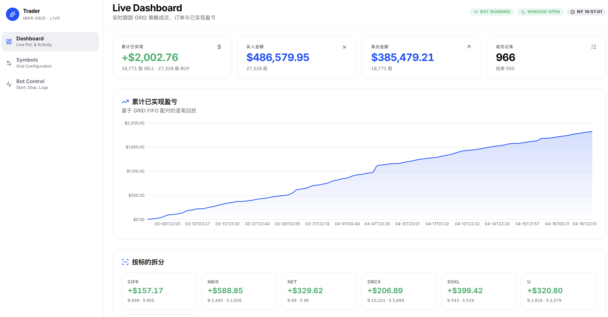

# IBKR Grid Console

一个用于展示 IBKR 网格交易前端控制台的 Next.js 项目，包含：

- Dashboard：查看成交、订单和已实现盈亏
- Symbols：管理每个标的的网格参数

## Dependencies

运行这个项目需要：

- Node.js
- npm
- 一个可用的后端 API（用于提供 `/api/*` 数据）

执行 `npm ci` 会安装当前前端依赖，包括：

- Next.js / React / TypeScript
- Tailwind CSS / PostCSS
- Radix UI
- Recharts
- Lucide React
- Sonner

## Usage

首次启动可以直接执行：

```bash
cp .env.example .env.local && npm ci && npm run dev
```

默认会把 `/api/*` 代理到 `http://127.0.0.1:8500`。如果你的后端地址不同，修改 `.env.local` 里的 `API_PROXY_TARGET` 即可。

## Stack

- Next.js 16
- React 19
- TypeScript
- Tailwind CSS 4
- Radix UI
- Recharts

## Demo


